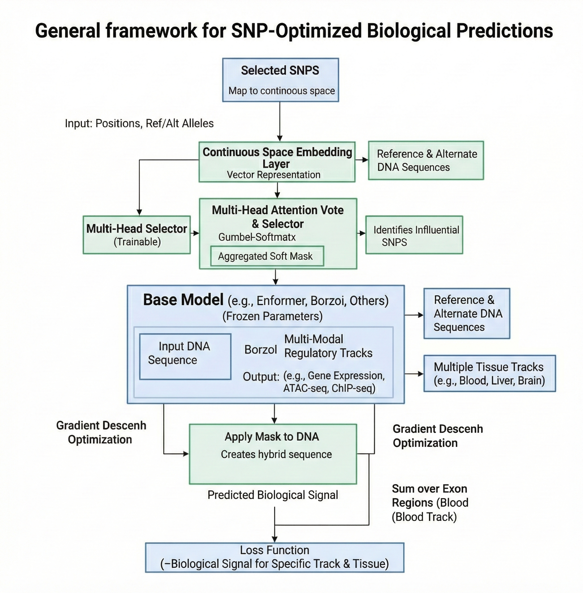

# MUGO: Multi-Head Genomic Optimization

**MUGO** is a differentiable combinatorial optimization framework designed for discovering causal variants in the non-coding genome. By leveraging **Gumbel-Softmax relaxation** and **Straight-Through Estimators (STE)**, MUGO enables end-to-end gradient-based optimization on discrete DNA sequences.

  

## Key Features

* 🧬 **Model-Agnostic**: Compatible with Borzoi, Enformer, HyenaDNA, and other PyTorch-based genomic models.
* 🎯 **Multi-Modal Objectives**: Optimize for Gene Expression, Chromatin Accessibility (ATAC), or TF Binding.
* 📉 **Variance Reduction**: Built-in Multi-Head Consensus strategy to filter stochastic noise.
* 🚀 **Production Ready**: Easy-to-use Python API for high-performance computing.

## Citation

If you use MUGO in your research, please cite our KDD 2026 paper (under review).